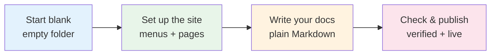
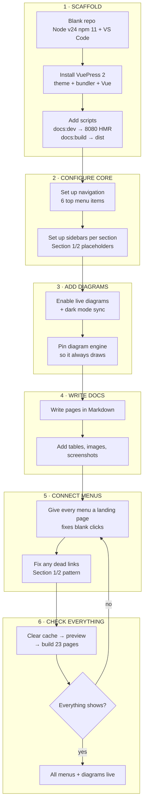

# Why I built a Knowledge Base Agent — and how it helps you find any doc in seconds

{Screenshot placeholder: Before — empty D:\KnowledgeBase with just .git | After — sidebar with 6 sections, Knowledge Base + AI Projects + Copywriting + SEO Guides + News Articles, each with Section 1/2 placeholders}

## 1. Imagine you just joined a team...

You open the docs to answer a question — how do we run a campaign? Where does imported data live? Who can change access? Before this agent, that meant asking around or digging through scattered files.

Now you click **Knowledge Base** in the top menu, pick **Overview**, and the answer is two clicks away. Campaigns, data import, access control — each has its own landing page and a short `Section 1 / Section 2` you can rename or duplicate. A new hire finds what they need without a meeting. That's the job this agent does.

## 2. What you can do without any code

- **Add a page:** duplicate `Section 1` → rename the file → it shows up in the left menu.
- **Fix a blank menu:** every menu gets its own landing page automatically, so clicks never land on a 404.
- **See it live:** write, save, refresh `http://localhost:8080` — the preview updates instantly.

{Screenshot placeholder: editing a .md file in VS Code on the left → instant preview on localhost on the right}

## 3. How it works — simple view (4 steps, live Mermaid hero)

> Live diagram — same engine that draws *AI Projects > Sports Fantasy Lineup Agent > Flowchart*. It updates with the site's light/dark mode.

*Legend: Blue = setup, Green = structure, Orange = writing, Pink = publishing. From empty to live in one afternoon.*

## 4. The full picture — if you want the details

Show 7-stage technical flow (for developers — expands in place)

