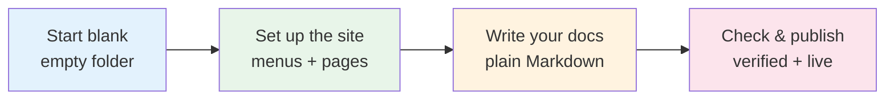
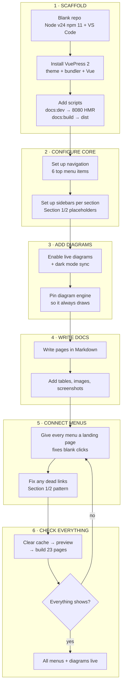

# Knowledge Base Agent

This is the knowledge base agent that I used to build the [Knowledge](../knowledge/overview/overview.md) section.

## What you can do without any code

- **Add a page** duplicate `Section 1` → rename the file → it shows up in the left menu.
- **Fix a blank menu** every menu gets its own landing page automatically, so clicks never land on a 404.
- **Live version** write, save, refresh `http://localhost:8080` — the preview updates instantly.

## How it works

## Flowchart

