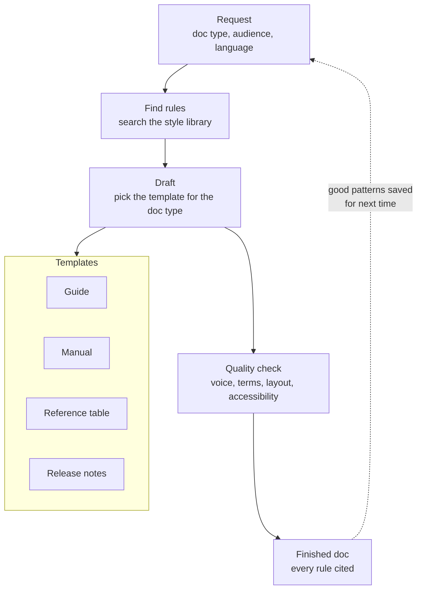

# Technical Writing Agent

- The technical writing agent uses a RAG implementation that gives suggestions, examples, or written documents based only on resources retrieved from specific documents given to it: official IBM, RedHat, & Microsoft technical writing guidelines.
- Also has an integrated Dutch language only agent that uses professional technical writing terminology in NL. Is not invoked unless specifically instructed to do so.
- Every claim is retrieved from a searchable library of style guides before writing, then checked against a quality gate.

## How the Agent Works

English and Dutch use separate shelves: English questions never see Dutch
rules unless Dutch is explicitly requested.

## Proof It Follows Its Rules

| Question asked | Rule found | Result |
| --- | --- | --- |
| How to write procedure steps | Numbered steps, one action each | Found in procedures guide |
| How to style button names | Exact text in bold | Found in UI guide |
| Which tense for release notes | Present for new, past for fixed | Found in release-notes guide |
| When to use formal address in Dutch | Formal-address rule | Found in Dutch guide, Dutch only |
