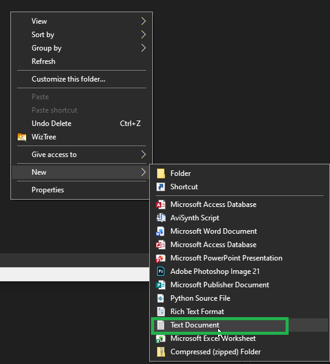
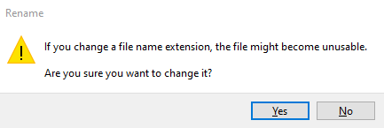
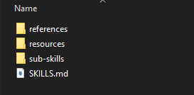
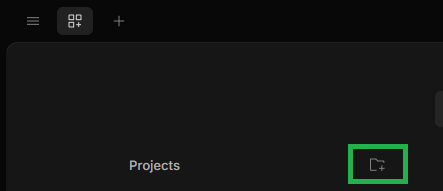
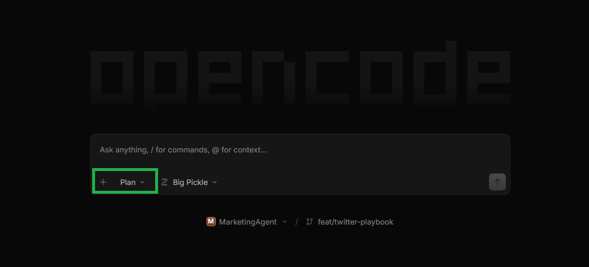

# AI Assistant 101: How to create your own AI Agent

**You can create an AI agent that will retain instructions, skills, and restrictions based on a specific topic**. Let's create a basic folder with files that work together which will become our AI agent - a skilled professional that uses his competencies to perform specific tasks.

## Files & Folders vs Memory: Why files & folders are Better

Most modern AI tools already have a dynamic memory that can easily recognize what was being talked about via individual sessions. This removes the need for creating specific files & folders. However, this approach has its own drawbacks:

- while convenient, storing AI agent "training sessions" in memory **costs a lot more tokens**;
- if there are too many instructions, it can get too convoluted for the AI agent, making it unable to make **informed predictions**. This is due to the lack of structure for instructions added to the memory.

Compare it to the "*file & folder*" approach:

- skills, instructions, restrictions, etc. are stored in their own files - like cabinet drawers;
- less token usage: the AI agent spends less time "thinking" and more time sifting through and understanding the instructions, following rules & restrictions;
- the whole structure of an AI agent can be built through regular instructions in a command prompt. However, if we want to focus on conserving token usage, **it is way more efficient to create the files & folders manually**.

## Creating your agent folder

For this example, we'll be building a ***marketing agent***.

:::tip
Since the knowledge bank of the AI agent will progressively increase, consider placing your agent in a disk that has plenty of space.
:::

**Prerequisites**

- desktop AI tool (e.g., **OpenCode**);
- **Visual Studio Code**.

1. Create a folder called **Marketing**.
2. Open the **Marketing** folder.
3. Right-click in your folder and click **Text Document**.

4. Name the new document *SKILLS.md*.

Make sure to remove the default name, and the file extension (*.TXT*). Once you do that and enter *SKILLS.md* as the new name, you will be prompted with the following message:

5. Click **Yes**.

You have created the agent folder with a *SKILLS.md* file. In the next step, we will further expand our AI agent directory.

## Structuring your AI agent folder

Since we are making a simple marketing AI agent, let's, firstly, consider what tools our agent might need:

- a *sub-skills* folder where we can store mini *SKILLS.md* files that are adjacent to the skills needed for a marketing agent, but not directly related and required to perform market research (e.g., a skill that creates *.PDF* files for visuals called *visualizer.md*). Remember the [Files & Folders vs Memory: Why files & folders are Better](#files--folders-vs-memory-why-files--folders-are-better) section - the folder & file approach allows us to segment skills that are less relevant to the core skills of the marketing agent. This way we minimize our token usage and not "overwork" the AI agent, giving us faster results with limited context.
- a *reference* folder where we can store all our projects done with the AI agent (generated market research, publications, etc.). Just like the *sub-skills* folder, we can invoke the *reference* folder whenever we need to reference a piece of content from earlier. Again, this saves us tokens because the agent already has the information on hand, and doesn't need to scrape the internet for new information.
- a *resource* folder where the AI agent can pull from a specific pool of verified documents (e.g., a marketing book *.PDF*, a list of common words used in marketing) to create compelling marketing documents with informed predictions.

At this point, your *Marketing* folder should look something like this:

At the moment, the *references* and *resources* folders can be left empty. The *sub-skills* folder should have at least 1 *.md* file (e.g., *visualizer.md*).

## Preparing the SKILLS.md file

We can fill out the core *SKILLS.md* file in several ways, two of which are:

- opening the *Marketing* folder via our AI tools (e.g., OpenCode) and asking the AI agent to "become" a marketing agent by entering a prompt with the required skills, restrictions, and instructions;
- filling out the *SKILLS.md* file manually.

For this example, let's prompt our AI agent to do the work for us.

1. Open your AI desktop tool.
2. If you are using **OpenCode**, click the **Add project** button.

3. Select your *Marketing* agent folder and click **Select folder**.
4. Click the *...* button and click **New session**.

5. In the chat window, select **Plan**.

:::tip
The **Plan** option allows the agent to plan its next steps before executing any actions. It's a good way to check how the agent understood your prompt.
:::

6. Enter a prompt to train your agent.

Example:

*You are a professional marketing agent that carries out market analysis, plans out the marketing strategy, creates the material for engagement, and is able to track and learn from mistakes. You will document all your skills in the **SKILLS.md** file. You will use the resources provided in the **resources** folder to train yourself on verified documents. You will use the skills defined in the **sub-skills** folder only when specifically asked to do so.*

7. Click **Send** (or press *Enter*).
8. Explore the plan given by the agent.
9. If you are satisfied with the plan, switch to **Build**, type in *Build* and click **Send**.

You've set up your marketing agent. At this point, the structure of your **Marketing** folder should represent a similar structure:

| # | Skill | Invoked when | Primary output |
|---|---|---|---|
| 1 | **Market Analysis** | Understanding a market, sizing it, defining ICP, finding a positioning gap | `references/market-analysis/` |
| 2 | **Marketing Strategy** | Deciding channels, budget, phasing, and how success is measured | `references/strategy/` |
| 3 | **Engagement Material** | Producing copy, messaging, or content for a defined audience and channel | `references/campaigns/` |
| 4 | **Measurement & Learning** | Reviewing results, logging failures, running experiments, updating the agent | `references/lessons-learned/` |
| S | **Visualizer** *(sub-skill)* | **Only on explicit request** | Chart spec, Mermaid, CSV |

You can further your AI agent by including, for instance, a *PROGRESS.md* file: if you tend to correct and guide the agent based on your own skills & competencies, you can instruct it to record its mistakes in the *PROGRESS.md* file, and give it guidelines on how to improve the content.
