# Sports Fantasy Lineup Agent

**One of my first agents. It's an agent that builds optimal 5-player fantasy sports lineups.**

**The MAX price of a 5-man lineup is limited to $1M.**

## Summary

- The agent essentially takes a 7-stage tournament pipeline (Detect > Pool > Player Profiles > Score > Optimization > Crosscheck > Deliver. See the Flowchart.) + exhaustive optimizer (checks every single 5-player combo, and chooses the best scoring one) grounded in real performance data (based on the perfomance of the last 3 months) to determine the best 5-player lineup.
- At the end of each tournament (or should I say delivery of the optimized team), the optimal fantasy team is placed in an archive (PAST.md).
- Also, at the end of each fantasy game, you can choose if you want to invoke the "PROGRESS.md" sub-agent, which tracks all the lessons that were learned when building a specific fantasy team. 
- This "PROGRESS.md" file is specifically built so you can keep training your fantasy agent on other forms of context that could potentially impact their performance. Whether that would be nerves in big games, performance against a specific opponent, etc. However, it is made only on-demand, because sometimes there's just no lessons to be learned.


## Past struggles

- I ran this for two separate tournaments. With the initial optimizer for the best fantasy lineup, it checked every single combo one by one, even if the lineup was already the strongest based on recent performance. This meant that it took a very long time, and spent more tokens to generate an optimal fantasy team. 
- The new optimizer now skips the process of pairing essentially the "best" fantasy lineup (based on recent performance) against all other combinations, because their past stats show that they can't theoretically beat the lineup that amounts to the "best" performance in recent showings.

## Technical issues
- If there are, let's say, 80-players per pool, there are around 5.46M legal combinations (a maximum of 2 players per club), even after optimizing, the agent can still be quite slow.
- Fantasy league pages usually require an account to view the prices, and this basically blocks anonymous scraping. So you essentially need to provide screenshots, or raw data of the prices to get your fantasy lineup.

## Flowchart

```mermaid
flowchart TD
    U(["USER PING<br/>'new fantasy: &lt;tournament&gt;'"]) --> D

    subgraph S1["1 · DETECT"]
        D["Check fantasy feed for the tournament id"]
        D -- "Feed lags (no id yet)" --> SH["Screenshot flow:<br/>user saves salary list to<br/>references/&lt;tournament&gt;.png,<br/>agent transcribes salaries"]
        D -- "id found" --> P
        SH --> P
    end

    subgraph S2["2 · POOL"]
        P["Bracket clubs only<br/>(never prize tables)"]
        P --> CFG["Write configs/&lt;tournament&gt;.json<br/>rosters + IDs + exact salaries,<br/>advancement weights, windows,<br/>competition tiers"]
    end

    subgraph S3["3 · PROFILES"]
        CFG --> F["fetch script<br/>--workers --refresh<br/>(threaded, rate-limited, resumable)"]
        F --> PROF["profiles_&lt;id&gt;.json<br/>last-month + 3-month form,<br/>home/away splits, tournament splits"]
    end

    subgraph S4["4 · SCORE"]
        PROF --> SC["form × big-game factor ×<br/>advancement / expected games"]
        SC --> VX{"Low-output?<br/>form &lt; 1.00<br/>+ negative scoring balance"}
        VX -- "yes (stability rule)" --> OUTX["VETOED"]
        VX -- "no" --> FL["Flag: flat-track · cold ·<br/>small-sample · weak split · bad head-to-head"]
    end

    subgraph S5["5 · OPTIMIZE"]
        FL --> OPT["optimizer script<br/>(branch-and-bound)"]
        OPT --> BEST["Best 5-player combo<br/>(≤$1,000k, max 2/club)<br/>+ closest alternatives + gaps"]
    end

    subgraph S6["6 · CROSSCHECK"]
        BEST --> MU["Matchups:<br/>style fit + head-to-head + bracket branches"]
        MU --> RB["Roles/bonuses<br/>by player archetype"]
        RB --> MS["News sweep<br/>(injuries / availability)"]
        MS --> KILL{"Model pick survives?"}
        KILL -- "no (flagged: consistency / matchup / sample…)" --> ALT["Take flagged alternative"]
        KILL -- "yes" --> DEL
        ALT --> DEL
    end

    subgraph S7["7 · DELIVER"]
        DEL["Lineup + salary proof<br/>+ flags + variants"]
        DEL -- "only if explicitly asked" --> ARC["Archive to history log"]
    end
```



- Form index: 1.00 = league-average output. Above 1.00 is above average, below is below.
- Small-sample guard: fewer than 5 recent appearances blends last-month form toward 3-month form.

##  Scoring 

```
score = base × 100 × (0.65 + 0.35 × advancement) × bigGame
```

- `base` = last-month form index (blend toward 3-month if appearances < 5)
- `bigGame` = big-game output divided by base output, clamped 0.85–1.15, default 1.0. Needs ≥3 appearances in top-tier competition, else 1.0.
- `advancement` = expected games from bracket position + power ranking (favorite ~0.91, longshot ~0.30)
- Stability veto: reject any player with form < 1.00 AND negative scoring balance (scores fewer than the mistakes made). No matter how well the salary fits.
- Flat-track flag: regular-competition output exceeds big-game output by >0.10 (both ≥3 appearances). The number is built on easy fixtures and fades under pressure.

Splits tracked per player: last-month form, 3-month form, home/away splits, per-tournament splits, scoring output, errors, plus big-game vs regular-competition differential.

## Worked example: 16-club cup, 80 players
- Input: user-supplied salary screenshot → per-tournament config (80 players, exact salaries). Data feed never listed the tournament, so transcription was canonical.
- Corrections applied during pooling: replacement player in / fringe player out, one club swapped for another, one squad switch. All resolved before fetching.
- Fetch: 320 stat calls, 4 workers with shared rate limiter, ~4–5 min (was ~13+ min sequential). Second run on fresh cache: 0.10s, 0 requests.
- Format: two 8-club groups, top 3 advance; group winners skip to semifinals; championship series weighted 1.25x, single-game fixtures weighted 0.5x.

### Recommended lineup — $996k / $1,000k

| Player | Club | Salary ($k) | Last-month form | Note |
|--------|------|-------------|-----------------|------|
| Player A | Club G | 219 | 1.234 | hot month, group favorite |
| Player B | Club K | 205 | 1.292 | hottest month outside the stars |
| Player C | Club I | 195 | 1.480* | *4 appearances — see flag |
| Player D | Club M | 195 | 1.051 | cheap, big-game output holds |
| Player E | Club L | 182 | 1.066 | enabler; winnable group fixtures |

- Composition: 5 players, all different clubs, total $996k.
- Player C flag: 1.480 comes from 4 appearances (guard blends toward longer-term average, big-game factor already at max discount 0.85). Fallback: swap C → Player F ($196k, 1.190 / 9 appearances): total $997k, score −6.4.
- Why no double-star core: the two best individuals ($235k + $228k) leave ≤$550k for three players, forcing cold longshot fillers that project ~75 each. The spread lineup outscores every star-double tested.
- Single-game vs series note: no pick needs its club to win the tournament — all five pay off on quarterfinal/semifinal runs, the correct construction for a field this deep.

### Bonus calls
- Role triggers by archetype (on-screen role beats archetype on conflict): primary scorer, playmaker, defensive anchor, energy, support.
- Bonus placement: flat +5 sponsor bonus on highest floor (most expected games × hot month), top-scorer bonus on stars, clutch bonus on closers.

## Previous issues when optimizing teams
1. Guessed salaries → two wrong lineups. Fix: exact-salary-only rule; screenshot flow when the feed lags.
2. Wrong pool from prize list (8 clubs incl. 2 non-qualifiers; real pool was 6). Fix: bracket-slots-first rule, never prize tables.
3. $25k arithmetic slip (wrong 5th man in one option). Fix: hand-verify every sum; verify-then-recommend rule.
4. Aggregate form missed temperament (playoff drop-off came from manual review, not the model). Fix: flat-track flag (now data-measured), head-to-head checks.
5. Thin sample in the winner (Player C, 4 appearances). Guard softens but doesn't solve it. Fix: flagged + priced fallback (−6.4).

Principle: every bug becomes a rule. Optimizer constraints are applied as code, not advice.

## System map 
- Playbook: game rules + 8-step runbook + methodology + current tournament
- Constraints: stability veto, no logo-based veto (underdogs scored on their own numbers), verify-then-recommend with gaps and red flags
- Data registry: where every input lives (stats API, salary screenshots, per-tournament configs, profile caches) + freshness
- Availability sweep:  injuries / replacements / availability doubts before lock + every matchday
- Long memory:  past lineups, what hit/missed, newest-first. Archived only on explicit request, never bulk-loaded.
- Canonical scripts: threaded fetcher (`--workers`, `--refresh all|stale|none`) + branch-and-bound scorer/optimizer. 5.46M combos → 6 leaf checks + ~9.5k prunes. Same optimum proven on both tournaments.

## Limits + next steps
- No per-possession efficiency (no endpoint exposes possessions played) — per-game proxies only.
- Cold / no-data players (zero recent appearances) still need human judgment; the model only flags.
- No prediction-vs-actual loop yet — next step is scoring predicted vs actual fantasy points per pick and feeding the error back into advancement weights.
- Stronger small-sample rule: <5 appearances should demand big-game corroboration or cap at one such pick per lineup.
- Opponent-specific head-to-head as a first-class input for every shortlisted pick, every tournament.
